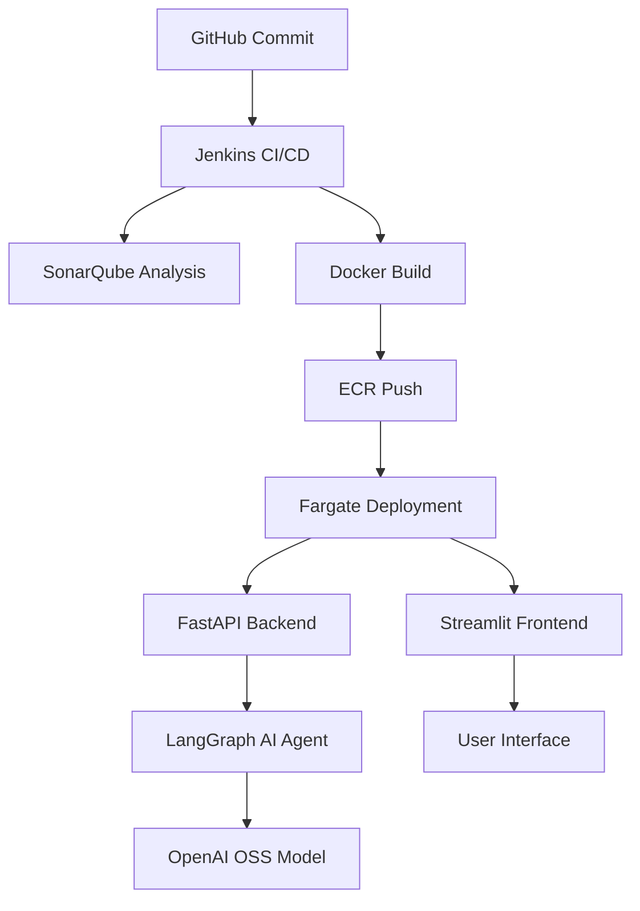

# 🤖 AIOps_Customizable AI Agent

A modular, scalable AI agent designed for intelligent operations and customizable interactions. Built with a **FastAPI backend** and a **Streamlit frontend**, this project integrates DevOps best practices, cloud-native deployment, and continuous quality assurance.

---

## 📦 Project Overview

This AI agent enables users to interact with customizable logic, workflows, and data pipelines. It supports:

- 🧠 **Custom AI logic** via modular backend
- 🎨 **Interactive UI** with Streamlit
- 🔍 **Code quality analysis** using SonarQube
- 🐳 **Containerized deployment** to AWS Fargate via ECR
- 🔁 **CI/CD pipeline** with Jenkins triggered by GitHub commits
- 🧬 **LangGraph React Agent** powered by **OpenAI OSS models** for dynamic, multi-step reasoning

---

## 🗂️ Project Structure

```
app/
├── __main__.py              # Entry point
├── backend/
│   └── ui.py                # FastAPI backend
└── frontend/
    └── api.py               # Streamlit frontend

src/
└── aiops/
    ├── logger/              # Logging utilities
    ├── exception/           # Custom exception handling
    ├── ai_agent/            # LangGraph-powered AI agent logic
    └── config/              # Configuration management
```

---

## 🔧 Tech Stack

| Layer         | Technology                     |
|---------------|--------------------------------|
| Backend       | FastAPI                        |
| Frontend      | Streamlit                      |
| AI Agent      | LangGraph React Agent + OpenAI OSS |
| CI/CD         | Jenkins + GitHub               |
| Code Quality  | SonarQube                      |
| Container     | Docker + Amazon ECR            |
| Deployment    | AWS Fargate                    |

---

## 🔄 Architecture Flow



---

## 🚀 Getting Started

### 1. Clone the Repository

```bash
git clone https://github.com/your-org/aiops-agent.git
cd aiops-agent
```

### 2. Run Locally

#### Backend (FastAPI)

```bash
uvicorn app.backend.ui:app --reload
```

#### Frontend (Streamlit)

```bash
streamlit run app.frontend.api.py
```

---

## 🧪 Quality Assurance

- Code is continuously analyzed by **SonarQube** for maintainability, reliability, and security.
- Reports are generated and linked to Jenkins builds.

---

## 🐳 Containerization & Deployment

- Docker images are built and pushed to **Amazon ECR**
- Deployed on **AWS Fargate** for serverless scalability
- CI/CD pipeline is triggered by GitHub commits via **Jenkins**

---

## 🧠 AI Agent Details

- Built with **LangGraph’s React Agent** for multi-step reasoning
- Powered by **OpenAI OSS models** for flexible, open-source intelligence
- Modular design allows easy customization of agent behavior and workflows

---

## 📬 Contributing

We welcome contributions! Please fork the repo, create a feature branch, and submit a pull request.

---

## 📄 License

This project is licensed under the MIT License.

---

## 🙌 Acknowledgements

Thanks to the open-source community and cloud-native tooling that made this project possible.

```